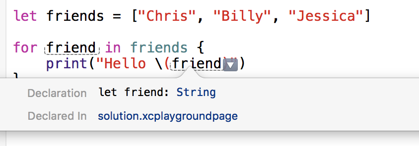

# Array - Iteration


> Hodor.

## Learning Objectives - The student should be able to.

- Explain the problem they are solving by being able to iterate over values in an `Array`.
- Create a `for-in` loop to iterate over an `Array`.

```swift
let friends = ["Chris", "Billy", "Jessica"]

for friend in friends {
    print("Hello \(friend)")
}

// Hello Chris
// Hello Billy
// Hello Jessica
```

- Explain that friend is a constant whose value is automatically set at the start of each iteration of the loop. They can't change this constant within the scope of the of the for loop.
- Explain that the type of the constant friend is of type `String` because the `friends` array is of type `[String]`. They should be able to see this by typing this into a playground file and option clicking the friend Constant to see its signature.
- Iterate over an `Array`, do something with the elements in the array and append them to a new array like so:

```swift
let numbers = [1, 2, 3, 4, 5]

var squaredNumbers: [Int] = []

for number in numbers {
    let squaredNumber = number * number
    squaredNumbers.append(squaredNumber)
}


print(squaredNumbers)
// prints "[1, 4, 9, 16, 25]"
```

- Understand that they can use `for-in` loops within a function to perform any calculation on the elements within that array passed into the function as an argument like so:

```swift
func numberOfStudentsWhoGotA100OnExam(grades: [Int]) -> Int {
    var studentsWith100 = 0

    for grade in grades {
        if grade == 100 {
            studentsWith100 += 1
        }
    }

    return studentsWith100
}

let gradesFromExam = [80, 75, 79, 92, 94, 100, 83, 100]

numberOfStudentsWhoGotA100OnExam(gradesFromExam) // 2
```

## What the student can do at this point

- Create variables and constants
- Is familiar with type annotations, type inference and string interpolation.
- Can create functions with return types.
- Is familiar with the String, Int, Double, and Bool type.
- Can perform arithmetic operations on Int and Double.
- Understands if and else clause statements.

## Outline / Notes

- Covering what is outlined in the Learning Objective needs to be done in an explicit manner. When showing them anything in code, we need to be thorough in our explanations as if we're iterating this to a 12 year old. I think this topic introduces a lot of what they can now do and might derail a few.
- To get around that, I think we build up slowly to harder examples making sure they get the basics down.
- I think in first showing them a `for-in` loop, we do so by having them follow along in a playground file, and adding a print function to see how/when stuff gets called like so.

```swift
let characters = ["Joy", "Sadness", "Bing Bong", "Fear", "Anger", "Disgust", "Riley"]

for character in characters {
    print(character)
}

// Riley
// Joy
// Sadness
// Bing Bong
// Fear
// Anger
// Disgust
```

- It's very good for them to know that they can place print functions throughout their methods to see when stuff is getting called and to get a handle of the flow. It's a great way for them to understand what's going on but also a good habit for them to make when they need to debug their code... WHY isn't this working.. well they might be making a ton of assumptions where adding print functions everywhere might help them decipher WHERE the problem is.

```swift
func didWeIncludeRileyInCharacters(characters: [String]) -> Bool {
    print("Function has been called, we're about to go into the for loop.")

    for character in characters {
        print("We are inside the for loop, character: \(character)")

        if character == "Riley" {
            print("Inside the if statement where character is equal to Riley.")
            print("About to return true.")
            return true
        }
    }

    print("End of our function, about to return false.")
    return false
}

didWeIncludeRileyInCharacters(characters)

// Function has been called, we're about to go into the for loop.
// We are inside the for loop, character: Joy
// We are inside the for loop, character: Sadness
// We are inside the for loop, character: Bing Bong
// We are inside the for loop, character: Fear
// We are inside the for loop, character: Anger
// We are inside the for loop, character: Disgust
// We are inside the for loop, character: Riley
// Inside the if statement where character is equal to Riley.
// About to return true.
```

- You can ask them... what do you think would print if we were to add Riley to the front of the array instead of being at the end. Also, what would print if we removed Riley from this array. Ask them to walk through it in their head to see if they can figure it out BEFORE they make the attempt at writing the code

- I think we should talk about `enumerate()` here but I'm not 100% sure on it. I'm up to discuss this if you think we shouldn't.

```swift
let myFavoriteZeldaGames = [
    "Ocarina of Time",
    "A Link to the Past",
    "Majora's Mask",
    "Wind Waker",
    "Twighlight Princess"
]

for (index, game) in myFavoriteZeldaGames.enumerate() {
    print("\(index + 1). The Legend of Zelda: \(game)")
}

// 1\. The Legend of Zelda: Ocarina of Time
// 2\. The Legend of Zelda: A Link to the Past
// 3\. The Legend of Zelda: Majora's Mask
// 4\. The Legend of Zelda: Wind Waker
// 5\. The Legend of Zelda: Twighlight Princess
```

- If we do cover enumerate, maybe we VERY briefly talk about Tuples (but not too much because Tuples will be brought up in another unit.

--------------------------------------------------------------------------------

## Improving Repetitive Tasks

In the last lesson you saw how to create and manipulate a collection of values. You also saw how to print individual items in that collection, so if you wanted to print a list of your three friends you could do the following:

```swift
let friends = ["Chris", "Billy", "Jessica"]
print (friends[0])
// "Chris"
print (friends[1])
// "Billy"
print (friends[2])
// "Jessica"
```

But what if you had 100 friends? Printing values like this will become tedious quickly and if you added more friends to the list, you would have to add more `print` commands to handle them.

Programming languages are very good at repetitive tasks, in fact they are better than humans, so in this lesson you will learn how to perform the same action(s) on values in an array multiple times. This is called _iterating over an array_ and introduces a new concept, a _loop_.

## Loops

```swift
let friends = ["Chris", "Billy", "Jessica"]

for friend in friends {
    print("Hello \(friend)")
}

// Hello Chris
// Hello Billy
// Hello Jessica
```

This examples starts with a familiar array initialization, but then instead of using the `print` command for each value in the array, says that `for` each value in the `friends` array, process the instructions in-between the `{}` symbols, which are called 'curly brackets' or 'mustaches'. In this example these instructions print the current value of `friend`, or the value of the current index in the `friends` array.

As `friends` is an array of type String, the type of `friend` will also be a String, and you can confirm this by typing the example above into a playground and _option + clicking_ `friend`.



## Loops and Calculations

You typically use loops to undertake more complex repetitive processing than printing the value of a variable, such as calculations.

Say you have a list of numbers and want to know what the square of each one and add that value to a new list. You create one array containing the original list of numbers and a placeholder array for the list of squared numbers. Then iterate through the array containing the list of numbers, perform the necessary calculations to find it's square and add that value to the second array. Let's look at some code!

```swift
let numbers = [1, 2, 3, 4, 5]
var squaredNumbers: [Int] = []

for number in numbers {
    let squaredNumber = number * number
    squaredNumbers.append(squaredNumber)
}

print(squaredNumbers)
// prints "[1, 4, 9, 16, 25]"
```

For the first `numbers` array, you use the `let` keyword as you don't want to change the values in the array. As you don't know what the values of the second `squaredNumbers` array will be yet, you initialize it first with no values. Inside the `for in` loop you generate the square of the value at the current index of the array and assign it to another unchanging variable. The next line introduces something called a _method_, which you can think of as a pre-written convenient way of performing actions on something. In this particular case `.append` adds a new value to the end of the `squaredNumbers` array.

This last example introduced a couple of new concepts, if you want to understand better what a line of code is doing then feel free to add `print` and `if` statements to inspect values (this is called 'debugging'). For example to see the value of `squaredNumber` you could add `print (squaredNumber)` inside the loop.

Maybe one of your friends deserves a special mention for being so awesome, so you need to find them in the `friends` list, and when you do, print a message for them:

```swift
let friends = ["Chris", "Billy", "Jessica"]

for friend in friends {
    print("We are inside the for loop, friend: \(friend)")

    if friend == "Billy" {
        print("Hello \(friend), you are awesome!")
    }
}

// We are inside the for loop, friend: Chris
// We are inside the for loop, friend: Billy
// Hello Billy, you are awesome!
// We are inside the for loop, friend: Jessica
```

In the above, you iterate the `friends` list printing the value of each index in the array. If the current value is equal to "Billy", then inside an if statement you print them a special greeting.

## Loops and Functions

In unit 1, lesson 8 you learned about functions, a convenient way to package functionality into reusable components. You can add any code can into a function, including loops.

Say for example you want to know how many of your friends got over 70 in their recent exam.

You first create an array of their grades and pass that array to a function. That function iterates through the array and maintains a count of how many grades were above 70, and returns that value.

```swift
func numberOfFriendsAbove70(grades: [Int]) -> Int {
    var studentsAbove70 = 0

    for grade in grades {
        if grade >= 70 {
            studentsAbove70 += 1
        }
    }

    return studentsAbove70
}

let gradesFromExam = [80, 45, 79, 32, 84, 100, 53, 60]

print numberOfFriendsAbove70(gradesFromExam)
// 4
```

Again, there's a lot happening in this example, so let's break everything down by starting at the bottom of the code. First you create an array called `gradesFromExam` of your friends grades that can't change and then pass that array to the `numberOfFriendsAbove70` function and print the returned result.

At the declaration of the `numberOfFriendsAbove70` function you set the incoming parameter as an array of numbers and the return value as a single number. Inside the function you first initialize to 0 a variable to count the number of grades over 70.

Next iterate through each value in the `grades` array and if the value at the current index is greater than 70 increase the value of `studentsAbove70` by 1\. Once the array has been fully iterated, return the total value or `studentsAbove70`.

[View this lesson on Learn.co](https://learn.co/lessons/ArrayIteration)
